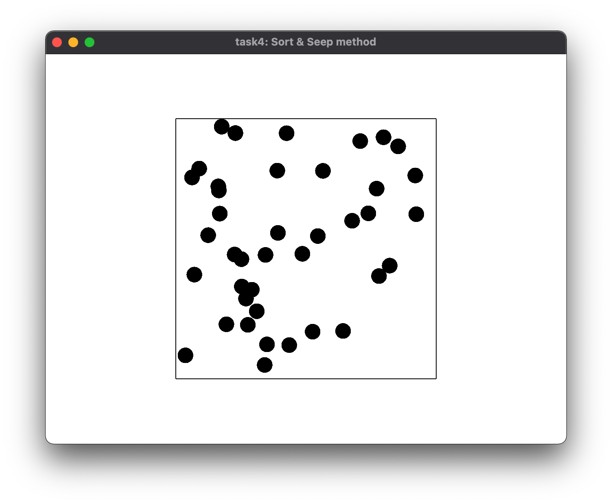
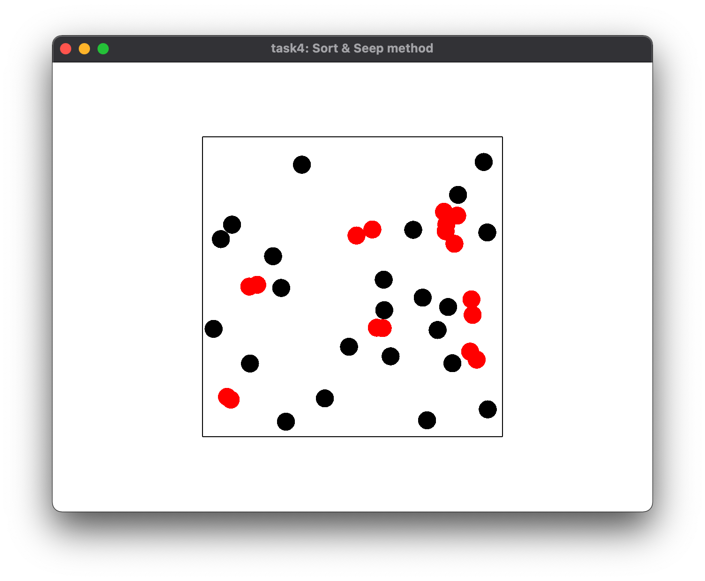
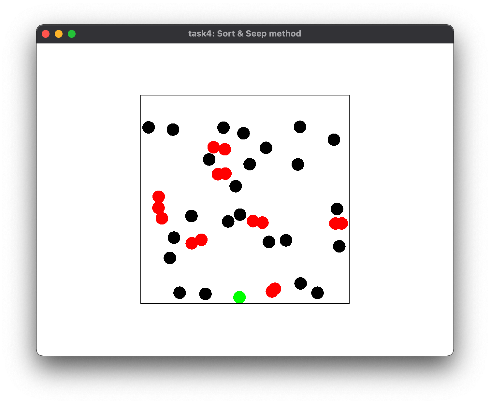

# Task4: Sort & Sweep Collision Culling

**Deadline: May 13th (Thu) at 15:00pm**


## Setting Up

Please look at the following document for environment setup, creating branch, and making pull request.

[How to Submit the Assignment](../doc/submit.md)

Additionally, you need the library [DelFEM2](https://github.com/nobuyuki83/delfem2) in `pba-<username>/3rd_party` 

```bash
$ cd pba-<username> # go to the top of local repository
$ git submodule update --init 3rd_party/delfem2
```

(DelFEM2 is a collection of useful C++ codes written by the instructor.)


## Problem1

Compile the `main.cpp` using the `cmake` on the `CMakeLists.txt` . Run the program and take a screenshot image of the window appeared. Paste the screenshot image below.

=== paste screenshot here ===



## Problem 2

Using the **Sort & Sweep Method**, implement the fast collision detection between the circles. Make the color of the collided circles red. This can be done by setting `true` the `is_collided` member variable of the `CCircle` class. Implementation should be just adding 5 -10 lines of code around line #135 of `main.cpp`.  Use the function `is_collide()` at line #102. Take a screenshot image and paste it below. 

=== paste screenshot here ===


### Further improvement
Wall collisions are highlighted in green. Since wall collisions are already handled by reflection, we can observe only a very short green flash (as intended).  
In case a wall collision happens together with the collision of another circle, red is prioritized:  
Red > Green > Black (normal color)  



----


