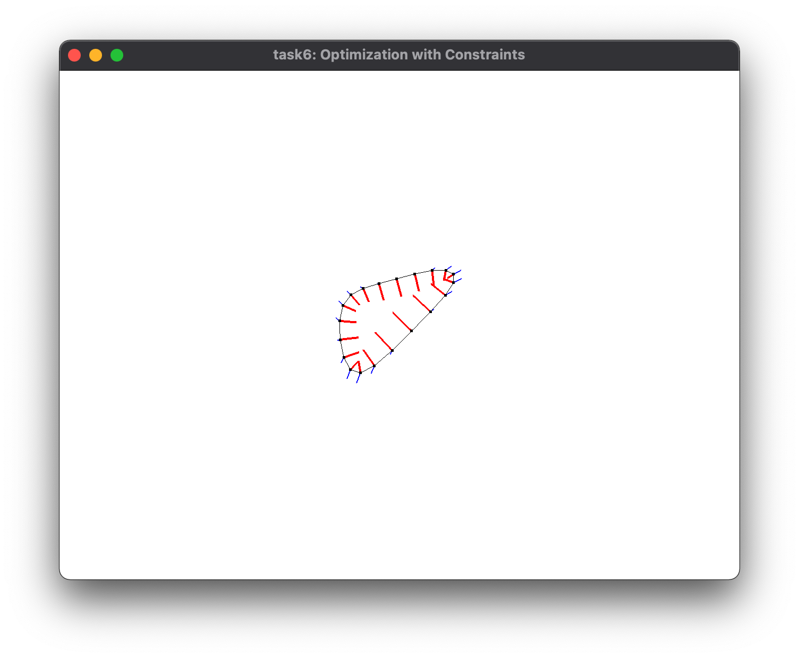
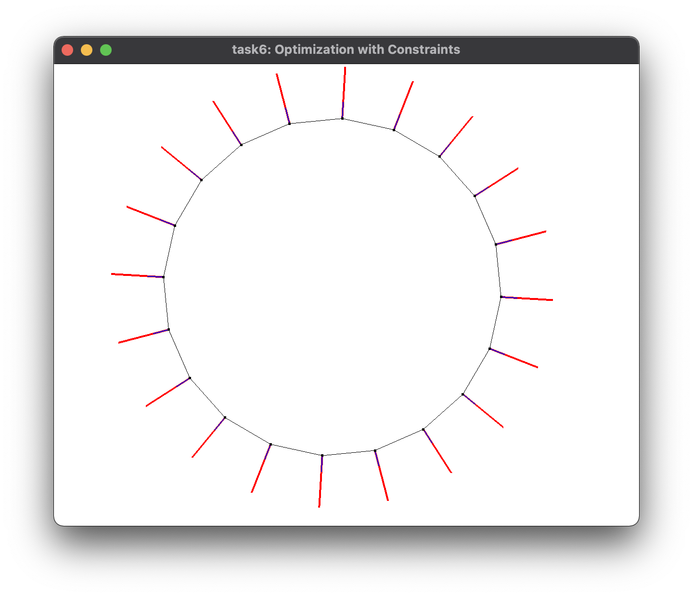

# Task6: Optimization with Constraints

- Optimize Mesh with Lagrange Multiplier
- **Deadline: June 10th (Thursday) at 15:00pm**


## Setting Up

Please look at the following document for environment setup, creating branch, and making pull request.

- [How to Submit the Assignment](../doc/submit.md)

In this assignment, it is necessary to install [Eigen](https://eigen.tuxfamily.org/index.php?title=Main_Page) library. 
Please follow the following document for setting up.    

- [How to set up the Eigen Library](../doc/setup_eigen.md)  

Additionally, you need the library [DelFEM2](https://github.com/nobuyuki83/delfem2) installed and updated in `pba-<username>/3rd_party` 

```bash
$ cd pba-<username> # go to the top of local repository
$ git submodule update --init 3rd_party/delfem2
```

(DelFEM2 is a collection of useful C++ codes written by the instructor.)


## Problem1

Build the `main.cpp` using `cmake`. Run the program and take a screenshot image of the window. Paste the screenshot image below by editing this mark down document.  
You will probably see a **highly distorted polygon shrinking **, but that's OK.

=== paste screenshot here ===



## Problem 2

Optimize the positions of the vertices of a 2D polygon such that its **area becomes one and the sum of the squared length of the edges (i.e., energy) is minimized**. The Lagrange multiplier method needs to be used. See the slide below for the overview of Lagrange multiplier method and its implementation. 


In the visualization, the black points and line represent the polygon, the red lines represents the constraint gradient w.r.t vertex position, the blue lines represents the energy gradient w.r.t. vertex position. **Observe that two gradients are parallel at the optimized configuration**.

**There are already working codes for energy minimization** (that's why polygon is shrinking), but the codes for areal constraint is not there yet. Write some codes around line #105 to add constraint with Lagrange multiplier method. 

If the code working well, you will see that **the energy steadily deceases to the convergence** and **the area converges to one**. Paste the screenshot image below by editing this mark down document.

=== paste screenshot here ===



